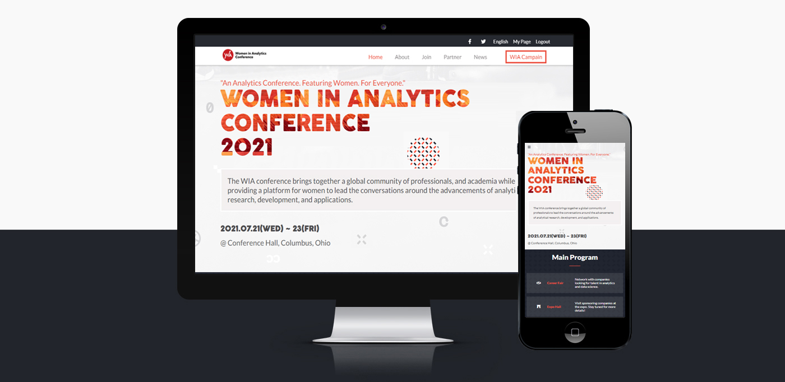

# Conference Website

> Meetups and professional conferences have grown into every possible industry around the world. The Internet makes it much easier for people to connect and attend these conferences. 
> 
>The goal of a conference website is two-fold: 
>1. Inform & spread awareness
>2. Capture ticket sales

## Built With

- HTML
- CSS
- Javascript

## Live Demo

[Live Demo Link](https://toliboff.github.io/Conference/)

## Getting Started

**This is ready for use Conference website**
**Modify this file to match your project, remove sections that don't apply.**

To get a local copy up and running follow these simple example steps.

### Prerequisites
  - NodeJS
### Setup
- Make sure you have `Node NPM` installed on your computer
- Clone or download this repo on your machine
- Enter project directory
### Install
- Run `npm install`
### Usage
- Open `index.html` in your browser

## Author

👤 **Tolibjon**

- GitHub: [@toliboff](https://https://github.com/toliboff)
- Twitter: [@tolib_tolibov](https://twitter.com/tolib_tolibov)
- LinkedIn: [Tolibjon](https://linkedin.com/in/tolibjon-tolibov)

## 🤝 Contributing

Contributions, issues, and feature requests are welcome!

Feel free to check the [issues page](https://github.com/toliboff/Conference/issues).

## Show your support

Give a ⭐️ if you like this project!

## Acknowledgments
* [Original idea of Women In Analytics Conference](https://womeninanalytics.com/conference/)
* [Original design idea by Cindy Shin in Behance.](https://www.behance.net/adagio07)
* [ Creative Commons license of the design.](https://creativecommons.org/licenses/by-nc/4.0/)
* [GitHub](https://www.github.com)
* [FontAwesome Icons](https://fontawesome.com)
* [Google Fonts](https://fonts.google.com)
* [Microverse](https://microverse.org)

## 📝 License

This project is [MIT](./MIT.md) licensed.
